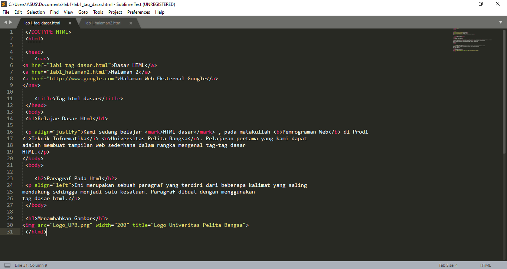
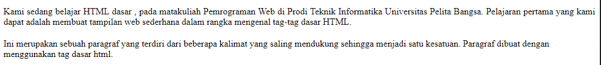
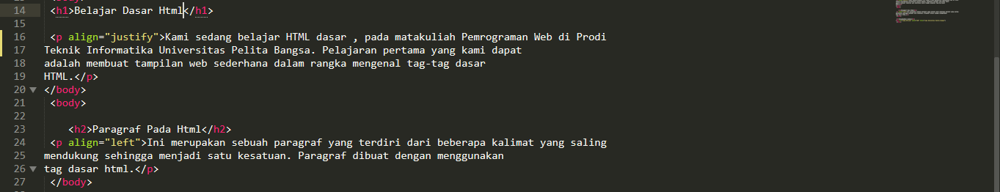
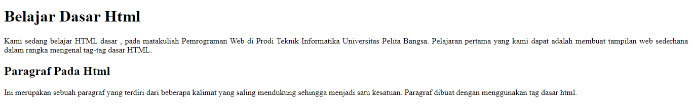
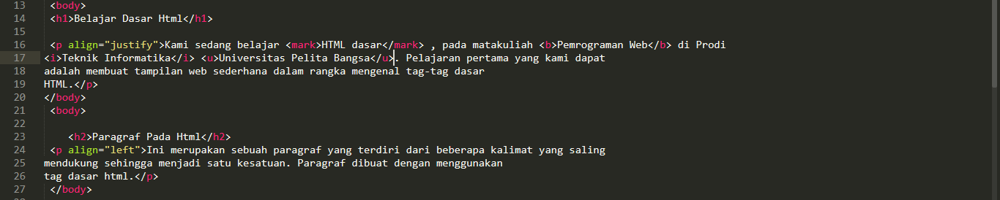
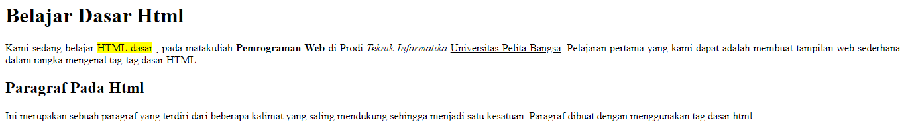
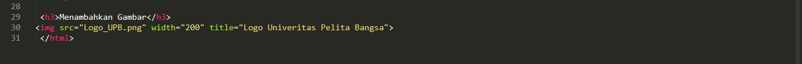
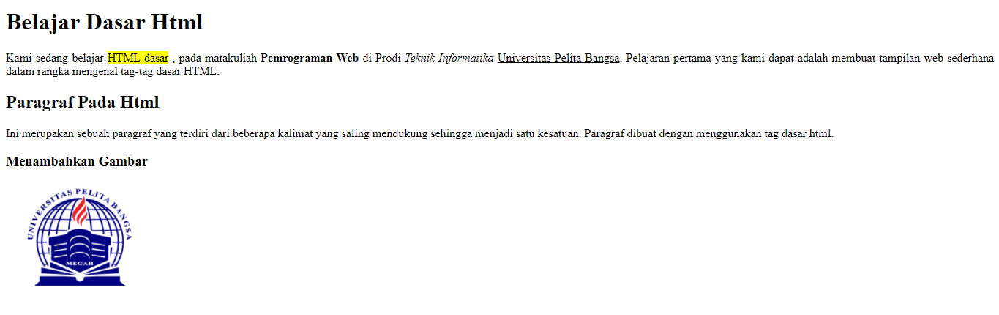
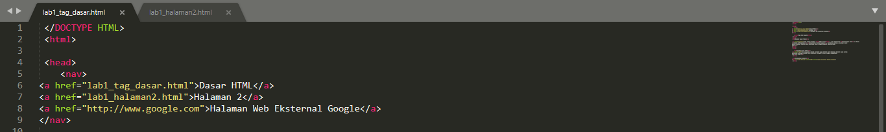
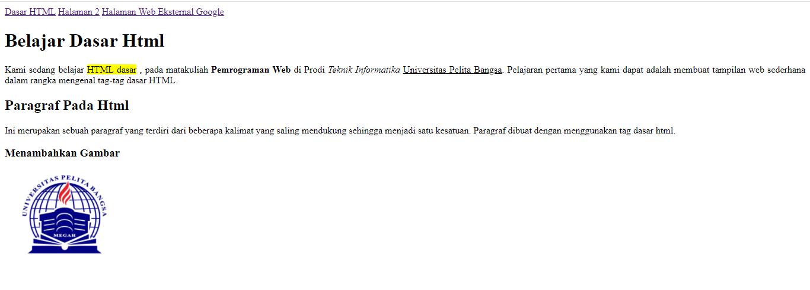

# PRATIKUM WEB HTML

# Aplikasi yang dibutuhkan
1. aplikasi text editor seperti sublime,visual code
2. google chroome

##Langkah - Langkah
### 1. Membuat Paragraf
Saya akan membuat paragraf menggunakan tag "p".
 
 
 
 Bukalah hasil edit diatas di google chrome dengan mengetik lab1_tag_dasar.html liat hasilnya.
 
 

### 2. Mengatur posisi paragraf
Atur atribut paragraf dengan menggunakan align = justify,left right dan center. disini saya menggunakan justify dan light.

Lalu refresh google chrome dan liat hasilnya.

### 3. Menambahkan Judul
Saya akan menambahkan judul h1 sebelum paragraf pertama dan h2 sebelum paragraf kedua.

Lalu refreh google chrome dan liat hasilnya.

### 4. Memformat Teks
Disini saya akan memformat teks menggunakan mark, b: huruf tebal, i: huruf miring, dan u: garis bawah

Lalu refreh google chrome dan liat hasilnya.

### 5. Menambahkan Gambar
Disini saya akan menambahkan gambar dengan menggunakan tag img

Lalu refreh google chrome dan liat hasilnya.

### 6.Menambahkan Hyperlink
Saya akan menambahkan hyperlink sebelum heading

Lalu refreh google chrome dan liat hasilnya.

Jawab pertanyaan Berikut
1. Lakukan perubahan pada kode sesuai dengan keinginan anda, amati perubahannya adakah error ketika terjadi kesalahan penulisan tag? 
2. Apa perbedaan dari tag "p" dengan tag "br", berikan penjelasannya! 
3. Apa perbedaan atribut title dan alt pada tag "img", berikan penjelasannya!  
4. Untuk mengatur ukuran gambar, digunakan atribut width dan height. Agar tampilan gambar proporsional sebaiknya kedua atribut tersebut diisi semua atau tidak? Berikan penjelasannya!  
5. Pada link tambahkan atribut target dengan nilai atribut bervariasi ( _blank, _self, _top, _parent ), apa yang terjadi pada masing-masing nilai antribut tersebut? 

jawab:
1. -
2.tag "p" hanya untuk memberikan paragraf dari sebuah kata dan tag "br" hanya break line, memindahkan sebuah kata ke baris selanjutnya.

3.Tittle adalah untuk memberikan judul pada gambar. Alt adalah text ini akan muncul di dalam wadah gambar ketika gambar tidak dapat di tampilkan.

4.agar proposional kedua atribut width dan height harus di isi, agar bisa mengatur keinginan ukuran pada gambarnya itu, kalau tidak di isi akan muncul secara default.

5._blank untuk membuka link di tab baru, _self untuk membuka link di frame link itu berada, _top untuk membuka link di frame paling atas (paling luar), _parent untuk membuka link di frame yang satu singkat di atas frame link tersebut berada.

